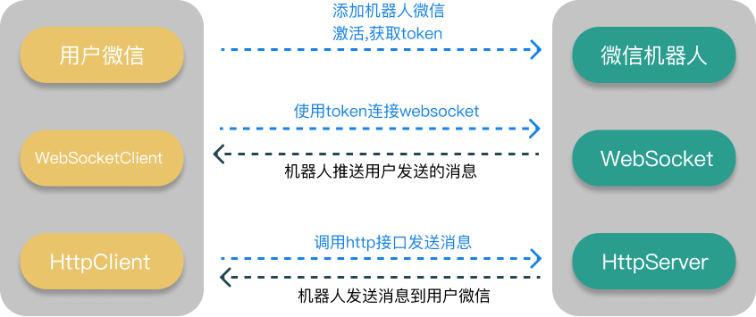

# ChatBot 聊天机器人

一个可编程的微信机器人  
你可以通过该机器人接入一些有趣的 API 来实现一些好玩的应用,例如快递查询、毒鸡汤、斗图等,也可以把自己人接入自己的服务中,作为告警、定时通知等服务.

## ⚠️ 关于群内机器人注意事项 ⚠️

每个人只能将机器人拉入一个群,多的机器人会自动退群.如果需要增加上限可加入交流群联系我.

## 目录

-   [项目介绍](#项目介绍)
-   [常见问题](#常见问题)
-   [接入流程](#接入流程)
-   [示例项目](#示例项目)
-   [自定义开发](#自定义开发)
-   [入群交流](#联系方式)

## 项目介绍

### Feature:

-   个人
    -   [x] 机器人接收文本、图片、表情、视频、音频、小程序消息
-   群聊
    -   [x] 机器人接收文本、图片、表情、视频、音频、小程序消息
    -   [x] 机器人被拉入群内事件
    -   [x] 机器人被踢出群事件
    -   [x] 群内成员新增事件
    -   [x] 群内成员退出/被踢事件
    -   [x] 机器人踢人接口
-   功能
    -   [ ] 命令:获取自己的微信号

类似 Server 酱,但是是通过个人微信实现.说通俗点其实是一个微信消息转发机器人,会把对应的消息转发到你的程序,并且提供了一定的发送接口能够让你命令机器人发送消息给你或者绑定的微信群.

---

主要流程图如下:



> 图上蓝色部分都是你需要做的内容

主要流程:

1. 程序启动后建立一个 websocket 的连接,用于转发你发给机器人的消息和相关的群消息.  
   为什么使用 websocket 而不是 http 是因为如果是 http 回调的方式很多个人网络没有公网 ip,还需要内网穿透的方式来调试开发,过于繁琐.
2. 项目提供了一系列的消息发送接口(例如常用的文本\图片\语音\视频等类型的消息),可以根据`1`中收到的消息做相应的逻辑处理.当然也可以直接使用相关接口发送消息,可以用于系统告警等,具体操作可以点击[这里](#常见问题)

## 常见问题

1. 我是一个新手,该如何开始?  
   可以添加底部的机器人激活获取 token,然后根据下载 demo,根据 demo 中的 README 项目直接尝试运行看效果,慢慢修改成自己的逻辑.
2. 我只想让机器人发送消息给我,不想要启动一堆 websocket 之类的进程.  
   从目前的流程来看是可以实现的,但是在此之前仍然需要通过 websocket 的推送获取一次自己的 wxid,具体可以激活后通过执行一次 demo 项目,然后发送一条消息给机器人,终端就会打印出收到的消息,其中`fromUser`字段就是你自己的 wxid.之后直接调用相应的 HTTP 发送消息接口,填入该 wxid 即可.
3. websocket 的服务端地址是多少?  
   `http://118.25.84.114:18881/ws?token={your_token}`

## 接入流程

1. 添加机器人为好友(机器人二维码在底部),一般在 1-2 分钟后会自动通过
2. 根据提示操作,可以发送`#帮助#`来获取具体指令,激活机器人,获取你自己的 token
3. 编写代码,连接机器人的 WebSocket Server 用于接收推送消息
4. 编写 Http Client 的代码,用于请求机器人接口,让机器人发送消息给你

## 示例项目

-   [ChatBot-Go](https://github.com/chatrbot/chatbot-go)
-   [ChatBot-Node](https://github.com/chatrbot/chatbot-node)
-   [ChatBot-PHP](https://github.com/chatrbot/chatbot-php)(暂未更新)  
    维护精力有限,Python 版本应该要滞后一些.Java 需要大佬帮一把了,欢迎提交 PR

可以进入各个项目查看具体的 README 介绍,不要忘了在启动项目前获得一个属于你自己的 token([如何获取 token](#接入流程))

## 自定义开发

程序开发的主要逻辑其实就是上面提到的主要流程中的部分.  
主要处理的就 2 个事情:

1. 接收 websocket 的消息
2. 调用 http 接口让机器人发送消息

### 建立 websocket 连接

这里拿 TypeScript 的伪代码举例:

```typescript
this.ws = new WebSocket( 'ws://' + this.host + '/ws?token=' + this.token)
this.ws.on('open', () => {
    console.log('连接websocket成功')
    this.heartBeatTimer = setInterval(() => {
        this.ws?.send('ping')
    }, 10000)
}
```

-   需要注意的是在连接建立之后需要发送一个 10s/次的心跳包,内容为字符串的"ping"即可,消息类型也为 Text.  
    服务端会做心跳超时检测,阈值是 20s/次,也就是说至少 20s 内有一次心跳.
-   如果自己用其他语言实现,例如 java 或者 python 记得做好断线重连(golang 和 ts 可以看[示例项目](#示例项目)中的例子),防止服务端更新重启导致的掉线.

### websocket 消息处理

目前机器人转发的消息类型主要分为两大类:

-   普通的消息,例如文字\图片\视频等
-   事件类型,主要是群内事件,例如群内有新成员加入,有人推群等.
    -   [事件列表](#Feature)
    -   [HTTP 接口](./HTTP.md)

整个消息处理流程目前是以"插件"的思想来完成,一条消息可以经过多个插件来处理.  
如果你是用`typescirpt`实现,可以查看相关[demo](https://github.com/chatrbot/chatbot-node/tree/main/src/plugins)中的例子,需要实现插件的抽象类,其实也就一个`do`方法:

```typescript
export abstract class Plugin {
    protected bot: ChatBot
    protected name: string

    protected constructor(name: string, bot: ChatBot) {
        this.name = name
        this.bot = bot
    }
    abstract do(msg: PushMessage, rawData?: string): void
}
```

其中的`PushMessage`就是程序会收到的消息,里面包含了具体的消息内容,发送人,接收人等信息,在我们调用发送接口的时候可能会用到.

这里分别举个收发消息和处理事件的例子:  
机器人在收到`@小明 踢`这样的消息时,会进行踢人操作,并且在群内发送一条消息告知操作结果.  
下面代码中`data.fromUser`就是`PushMessage`中这条消息/事件的发送人,其实也就是我们要发送消息的对象,原路返回的意思.如果是个人就是他的 wxId,如果是微信群则是群的 id.

```typescript
export class GroupPlugin extends Plugin {
    constructor(bot: ChatBot) {
        super("group", bot)
    }

    do(msg: PushMessage) {
        //踢人操作要求机器人必须为群管理员
        if (msg.msgType === PushMsgType.Message) {
            const data = msg.data as UserMessage
            const keyword = "踢"
            /**
             * 必须是文本消息
             * 必须是群内消息
             * 必须匹配到触发关键字
             */
            if (
                data.msgType === MsgType.MsgTypeText &&
                IsGroupMessage(data.fromUser) &&
                SplitAtContent(data.groupContent) === keyword
            ) {
                if (IsGroupMember(data.groupMemberRole)) {
                    this.bot
                        .sendText(
                            data.fromUser,
                            "@" +
                                data.groupMemberNickname +
                                " 你不是管理员,休想命令我",
                            [data.groupMember]
                        )
                        .catch((err) => {
                            console.log(err)
                        })
                    return
                }
                this.bot
                    .delGroupMembers(data.fromUser, data.atList)
                    .then(() => {
                        this.bot
                            .sendText(
                                data.fromUser,
                                "@" + data.groupMemberNickname + " 搞定了老板",
                                [data.groupMember]
                            )
                            .catch((err) => console.log(err))
                    })
            }
            if (data.msgType === MsgType.MsgTypeText) {
                this.bot.sendText(data.fromUser, "你好")
            }
        }
    }
}
```

完成插件内的逻辑后在主进程中调用即可,可以点击[这里](https://github.com/chatrbot/chatbot-node/blob/main/src/app.ts)查看调用例子.  
整个链路涉及到的核心数据在下面注释,每个版本的 demo 中也基本注释详尽,还有问题可以加群交流.

### 核心数据结构注释

```javascript
//所有消息的包装
{
    //消息类型,1000为转发的聊天消息,1001为群内事件消息
    "msgType": 10000,
    //data在msgType不同的时候会有不同的数据结构,目前会有转发消息和群事件消息两种
    "data": {}
}

//机器人转发的消息,包括文本、图片、视频等格式
{
    //下载语音的时候会用到
    "newMsgId":0,
    //发送人,这个也会是你发送消息的对象,即接口toUser字段的值就是这个
    "fromUser":"test",
    //消息中@了谁
    "atList":[],
    "createTime":0,
    //群内消息会变成"xxx发送了一个图片"这样的简短说明
    "pushContent":"",
    //机器人id
    "clientUserName":"test",
    //消息接收人id
    "toUser":"test",
    //暂时无用
    "imgBuf":"",
    //消息类型,具体看demo中的注释
    "msgType":1,
    //具体的消息内容,如果是其他格式的会是xml
    //如果是群内消息会变成 发言人id:消息内容 这样的格式
    "content":"test",
    //暂时无用
    "msgSource":"<msgsource />",
    // ======================================
    // 下面这个三个字段只有群内消息有用
    // 方便开发者调用,省去来自己解析content这一步
    // ======================================
    //谁@了机器人
    "whoAtBot":"",
    //发言人id
    "groupMember":"",
    //发言内容
    "groupContent":""
}

//群内事件
{
    //具体的事件id,这里100003只是举个例子,是成员离开事件
    "event":100003,
    //事件的中文描述
    "EventText":"群成员离开",
    //发生事件的群基本信息
    "group":{
        //群id
        "groupUserName":"",
        //群名称
        "groupNickName":"",
        //群头像
        "groupHeadImg":""
    },
    //发生事件的群成员信息
    "members":[
        {
            //群成员id
            "userName":"",
            //群成员昵称
            "nickName":"",
            //群成员头像
            "headImg":""
        }
    ]
}
```

## 联系方式

1. 请先添加机器人为好友,等待 1-2 分钟后会自动通过
2. 对机器人发送命令(记得带上#号): #交流群# 即可获取邀请链接

    
