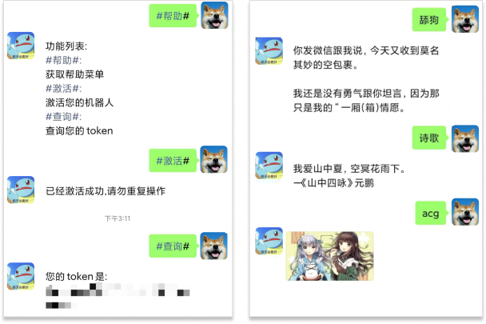

# ChatBot 聊天机器人

一个功能简单、稳定的聊天机器人.  
你可以通过该机器人接入一些有趣的 API 来实现一些好玩的应用,例如快递查询、毒鸡汤、斗图等,也可以把自己人接入自己的服务中,作为告警、定时通知等服务.

## 接入流程

> 图上蓝色部分都是你需要做的内容

## 具体步骤

1. 添加机器人为好友,一般在 1-2 分钟后会自动通过
2. 根据提示操作,可以发送`#帮助#`来获取具体指令,激活机器人
3. 编写代码,连接机器人的 WebSocket Server 用于接收推送消息
4. 编写 Http Client 的代码,用于请求机器人接口,让机器人发送消息给你

## DEMO

-   [ChatBot-Go](https://github.com/chatrbot/chatbot-go)
-   [ChatBot-Node](https://github.com/chatrbot/chatbot-node)
-   [ChatBot-PHP](https://github.com/chatrbot/chatbot-php)

## 功能

### 个人

-   [x] 机器人转发文本消息到 websocket 客户端
-   [x] 机器人发送文本类型消息
-   [x] 机器人发送图片类型消息
-   [x] 机器人发送表情类型消息

### 群聊

功能正在开发...

## 示例截图

## FAQ

Q:如何获取 Token?  
A:加入技术交流群,添加群内机器人为好友,然后发送相关指令激活获取

## 联系方式

